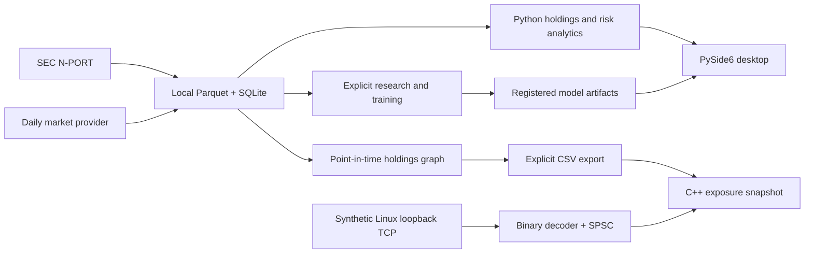

# ETF Genome

**ETF holdings analytics, point-in-time risk research, and a C++20 market-data foundation.**

ETF Genome turns public fund filings into local portfolio snapshots, measures concentration and mandate drift, and builds ETF–security graphs for direct shock scenarios. A PySide6 desktop app reads cached QQQ data and scores explicitly trained risk models. The C++20 component adds a synthetic Linux TCP feed, incremental binary decoding, bounded event processing, persistent sparse exposure updates, and separate component benchmarks.

This is a research portfolio project. It does not place orders, provide buy/sell recommendations, or claim trading profitability. Temporal graph forecasting remains [Phase 11 research](docs/PHASE11_ROADMAP.md).

## What is implemented

| Area | Current capability |
| --- | --- |
| Holdings | SEC N-PORT discovery and parsing, identifier normalization, incremental local storage |
| Portfolio analytics | HHI, largest positions, exposure summaries, holdings drift |
| Risk research | Daily QQQ features, publication-aware holdings joins, chronological model evaluation |
| Model lifecycle | Optuna studies, optional experiment tracking, candidate registration and explicit promotion |
| Shock graph | ETF–security snapshots, overlap, crowding, signed direct exposure |
| Native C++ | C++20 core, Linux nonblocking TCP/epoll feed, binary decoder, SPSC queue, sparse exposure updates, CSV/binary snapshots, latency benchmarks |
| Desktop | Cached QQQ overview, freshness labels, background refresh, local inference, Windows packaging recipe |

The repository contains source, configuration templates, and synthetic fixtures. Downloaded filings, price histories, trained models, private logs, and built executables are excluded. See [project status](docs/PROJECT_STATUS.md) for the implementation and verification boundaries.

## Architecture



Python owns data acquisition, provenance, storage, research, and the desktop. C++ consumes an explicitly exported graph and synthetic loopback events; it runs as a separate executable. Training and orchestration tools are separate from end-user inference. DuckDB queries fall back to Polars when the native library cannot load. See [native architecture](docs/NATIVE_ARCHITECTURE.md) for ownership and lifecycle details.

## Quick start

Run commands from the repository root. Python 3.12 is recommended; the package declares Python 3.11 or newer. Installation downloads dependencies, but the synthetic demo makes no SEC or market-data requests.

### Windows / PowerShell

```powershell
py -3.12 -m venv .venv
.\.venv\Scripts\python.exe -m pip install --upgrade pip
.\.venv\Scripts\python.exe -m pip install -e ".[desktop,dev,ml]"
$env:ETF_GENOME_OFFLINE_MODE = "1"
.\.venv\Scripts\python.exe scripts\run_vertical_slice.py
.\.venv\Scripts\python.exe apps\desktop\main.py
```

### Linux / Bash

```bash
python3.12 -m venv .venv
source .venv/bin/activate
python -m pip install --upgrade pip
python -m pip install -e ".[desktop,dev,ml]"
export ETF_GENOME_OFFLINE_MODE=1
python scripts/run_vertical_slice.py
```

The CLI prints JSON for two synthetic holdings snapshots, concentration, and drift after a Parquet storage round trip. The fixture is a fictional fund, not QQQ. A fresh desktop launch shows QQQ's empty-cache state until real holdings are synced. Linux can run the CLI and native component; the shipped desktop target is Windows. Linux Qt tests use the offscreen platform and may require system Qt libraries.

Before running pytest, unset `ETF_GENOME_OFFLINE_MODE` or set it to `false`. The tests exercise fake online flows as well as offline behavior; forcing offline mode globally changes those fixtures. Ordinary tests still make no live provider requests.

## C++20 component

The native library keeps portfolio weights signed, distinguishes missing weights from zero, and applies `sum(weight * shock)` to a static scenario. A persistent price engine updates only holdings linked to each changed security. Linux adds RAII sockets, level-triggered epoll, an incremental big-endian decoder, and a bounded SPSC pipeline with explicit acquire/release synchronization and stop-aware backpressure. Portable graph, protocol, queue, and benchmark code is also built by the Windows CI configuration.

Build with CMake 3.16+ and a C++20 compiler. On Windows, use a Developer PowerShell with Visual Studio C++ Build Tools available.

```text
cmake -S native -B build/native -DCMAKE_BUILD_TYPE=Release -DETF_GENOME_WARNINGS_AS_ERRORS=ON
cmake --build build/native --config Release
ctest --test-dir build/native -C Release --output-on-failure
```

Windows, using the Visual Studio multi-configuration generator:

```powershell
.\build\native\Release\etf-genome-native.exe demo
.\build\native\Release\etf-genome-native.exe replay 100000
.\.venv\Scripts\python.exe scripts\export_native_graph.py --demo --output data\native
.\build\native\Release\etf-genome-native.exe shock --edges data\native\edges.csv --shocks data\native\shocks.csv
```

Linux, with a single-configuration generator:

```bash
./build/native/etf-genome-native demo
./build/native/etf-genome-native replay 100000
python scripts/export_native_graph.py --demo --output data/native
./build/native/etf-genome-native shock --edges data/native/edges.csv --shocks data/native/shocks.csv
./build/native/etf-genome-benchmark --mode all --events 1000000
```

For the Linux feed, run these in two terminals with matching instrument counts:

```bash
./build/native/etf-genome-feed-server --port 9000 --events 100000 --instruments 1024
./build/native/etf-genome-feed-client --port 9000 --instruments 1024
```

The feed binds only `127.0.0.1`. Prices and all checked-in examples are synthetic. SIGINT/SIGTERM request an orderly stop. The [native guide](native/README.md), [binary protocol](docs/BINARY_PROTOCOL.md), and [performance record](docs/NATIVE_PERFORMANCE.md) describe commands, measurement scope, and verification limits. Linux networking is excluded from Windows builds; the desktop does not depend on it. Full pybind11 integration is not implemented.

`replay` accepts an optional event count. A Windows single-configuration generator may put the executable directly under `build/native`. The CSV contract is deliberately small:

| File | Exact header | Values |
| --- | --- | --- |
| `edges.csv` | `etf_node_id,security_node_id,security_ticker,portfolio_weight` | Fractional signed weights; blank means missing |
| `shocks.csv` | `key,shock` | Security node id or unambiguous ticker; fractional shock |

For example, `0.10` is a 10% holding and `-0.20` is a −20% shock. A missing weight contributes nothing and is counted separately. See [native documentation](native/README.md) for queue assumptions, error handling, and limitations.

## Real data and risk workflow

Create a local `.env` from [.env.example](.env.example), or set environment variables in your shell. Keep real values local.

| Variable | Purpose |
| --- | --- |
| `ETF_GENOME_SEC_USER_AGENT` | Application name and your contact email for live SEC requests |
| `ETF_GENOME_TWELVE_DATA_API_KEY` | Your market-data provider key for daily QQQ prices |
| `ETF_GENOME_DATA_DIR` | Optional local data directory override |
| `ETF_GENOME_OFFLINE_MODE` | `1` disables desktop network refresh |

Remove the offline flag before syncing. In PowerShell, use `Remove-Item Env:ETF_GENOME_OFFLINE_MODE`; in Bash, use `unset ETF_GENOME_OFFLINE_MODE`.

After configuring your credentials, run the following with your environment's Python (`.\.venv\Scripts\python.exe` on Windows):

```bash
python scripts/sync_real_qqq.py
python scripts/sync_market_qqq.py
python scripts/build_risk_dataset.py
python -m etf_genome.training.train_risk_baseline
```

Risk targets include forward 20-session volatility and drawdown. Holdings become available on the filing's publication date, rather than being retroactively attached to the portfolio report date. Training uses chronological splits; the desktop scores local artifacts and does not train on startup. A provider key and sufficient local history are needed for this workflow. Missing credentials or models are represented as unavailable status, not invented predictions.

Optional tuning and model promotion are documented in [Optuna](docs/OPTUNA.md), [experiment tracking](docs/EXPERIMENT_TRACKING.md), and [model lifecycle](docs/MODEL_LIFECYCLE.md). Install the corresponding extras only when using those tools. Provider terms and current access limits must be checked before downloading or redistributing data; histories are not distributed with this repository.

### Cached graph to native exposure

The graph workflow resolves the configured ETF universe against SEC identities. Unresolved or ambiguous funds remain explicit; a partial universe can produce a nonzero sync exit status.

```bash
python scripts/sync_graph_universe.py
python scripts/build_shock_graph.py YYYY-MM-DD
python scripts/run_shock_scenario.py YYYY-MM-DD configs/graph/example_shock.json
python scripts/export_native_graph.py --edges data/processed/graph/UNIVERSE/YYYY-MM-DD/edges.parquet --scenario configs/graph/example_shock.json --output data/native
```

Replace `YYYY-MM-DD` with your chosen graph as-of date and `UNIVERSE` with the manifest's universe id. The graph uses only cached filings published by that date. The exporter writes the native CSV contract above; use the `shock` command to consume it. Direct exposure is a mechanical scenario, not a causal model of secondary propagation. Details: [shock graph](docs/SHOCK_GRAPH.md) and [graph data model](docs/GRAPH_DATA_MODEL.md).

## Checks and packaging

Run these with the same Python environment used for installation. Unset the demo's offline flag first (`$env:ETF_GENOME_OFFLINE_MODE = "false"` in PowerShell, or `unset ETF_GENOME_OFFLINE_MODE` in Bash):

```bash
python -m ruff check src tests apps scripts
python -m ruff format --check src tests apps scripts
python -m mypy
python -m pytest
python scripts/check_publication.py
```

PowerShell also has `scripts/check.ps1`. Normal tests use synthetic fixtures and fake transports. Live integrations are opt-in through `ETF_GENOME_RUN_LIVE_SEC_TESTS=1` or `ETF_GENOME_RUN_LIVE_MARKET_TESTS=1` and need your own configuration. Native tests run through CTest and do not need Python or API keys.

The Python/native parity test is optional: set `ETF_GENOME_NATIVE_BINARY` to the built executable's absolute path, then run `python -m pytest tests/integration/test_native_parity.py`. It skips when no binary is configured. GitHub Actions workflows under `.github/workflows/` run Python quality checks and native builds/tests; their recorded results are the verification evidence, rather than a claim that remote CI has already passed.

See the [local validation record](docs/VALIDATION.md) for checks performed on this checkout and their limits.

Build the Windows application locally:

```powershell
.\.venv\Scripts\python.exe -m pip install -e ".[packaging]"
.\scripts\build_windows.ps1
.\dist\ETFGenome\ETFGenome.exe
```

The `onedir` output must be copied as a whole folder. The executable and trained artifacts are not included in the checkout. Frozen builds use `%LOCALAPPDATA%\ETFGenome` for local data unless overridden. See [Windows packaging](docs/WINDOWS_PACKAGING.md).

## Research boundaries

Airflow and Kubeflow definitions exist for research workflows; cluster execution is not a runtime prerequisite or a claim of this repository. The optional structural graph embedding baseline is separate from temporal forecasting. Phase 8 implements the native systems foundation. Phase 9 plans performance engineering and Linux profiling; Phase 10 plans pybind11 integration. Phase 11 retains selective security prices, publication-aware graph states, and temporal research.

**ETFGenome.exe does not require WSL2, PyTorch, PyG, or CUDA.** Temporal training commands are not implemented. See [project status](docs/PROJECT_STATUS.md), [Phase 11 design](docs/PHASE11_ROADMAP.md), and [orchestration architecture](docs/ORCHESTRATION_ARCHITECTURE.md). The [original Phase 8 roadmap](docs/PHASE8_ROADMAP.md) is retained as a historical proposal. Older Phase 1 notes describe historical development stages.

Contributions: [CONTRIBUTING.md](CONTRIBUTING.md). Handling credentials and vulnerability reports: [SECURITY.md](SECURITY.md).
