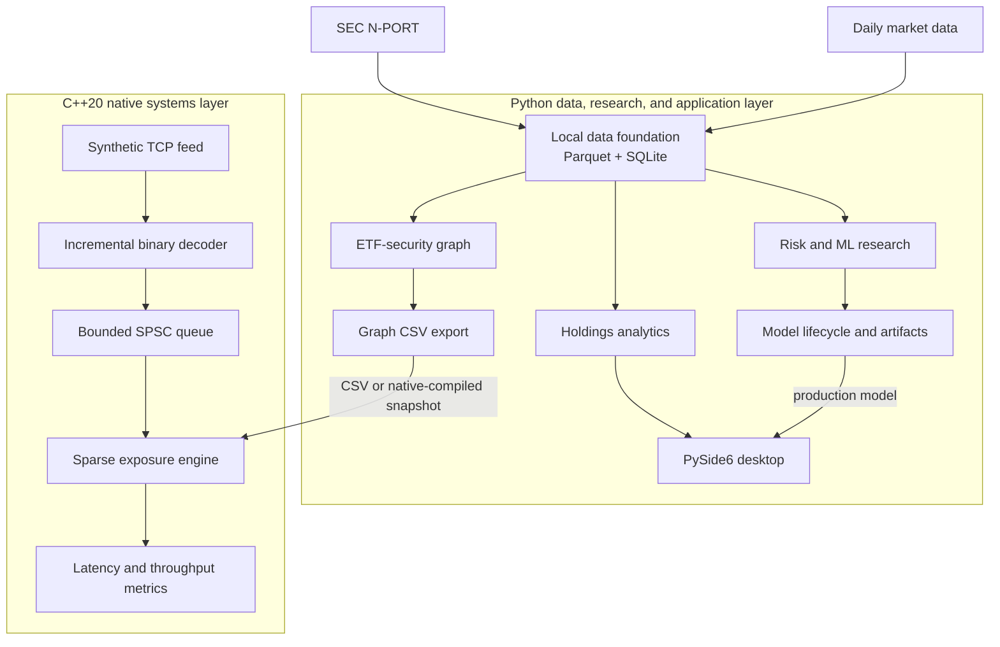

# ETF Genome

[](https://github.com/Onwcan/ETF_Genome/actions/workflows/checks.yml)
[](https://github.com/Onwcan/ETF_Genome/actions/workflows/native.yml)

ETF Genome is a hybrid Python and C++20 platform for point-in-time ETF holdings analysis, portfolio risk research, ETF-security graph analytics, and synthetic native market-data processing.

Public fund filings become publication-aware local snapshots. Python builds portfolio reports, risk datasets, model artifacts, and holdings graphs; C++ consumes exported graphs and processes synthetic price events through a bounded pipeline. A PySide6 desktop reads cached QQQ data and compatible local risk models.

The project connects four areas: **ETF data and analytics**, **risk and ML research**, **graph and direct shock analytics**, and **native systems engineering**. Correctness, explicit provenance, and measured performance define their shared boundaries.

## Current capabilities

| Area | Implemented capability |
| --- | --- |
| Data ingestion | SEC N-PORT discovery/parsing, normalized identifiers, cached daily market data, local provenance |
| Point-in-time analytics | Publication-aware holdings, concentration, exposures, and mandate drift |
| Risk research | QQQ features, forward volatility/drawdown targets, chronological evaluation, XGBoost and Optuna |
| Model lifecycle | Optional W&B/MLflow tracking, versioned candidates, explicit production promotion |
| Graph analytics | Multi-ETF holdings snapshots, overlap, crowding, and signed direct shock scenarios |
| Native systems | C++20 binary decoding, Linux TCP/epoll, bounded SPSC, sparse price exposure, snapshots, and benchmarks |
| Desktop | Cached QQQ overview, freshness/status display, background refresh, local model inference |
| Validation | Python quality checks, cross-platform native tests, sanitizers, publication checks, and Python/C++ parity |

Temporal graph forecasting is planned research. The structural embedding scaffold has not been validated by a successful training run. Airflow and Kubeflow definitions exist, but scheduler, container, and cluster execution are not established by their presence. See [project status](docs/PROJECT_STATUS.md) for exact implementation limits.

The source distribution includes synthetic fixtures and configuration templates. Downloaded histories, trained models, credentials, logs, and executables stay local. Research outputs do not establish investment recommendations, trading profitability, or causal contagion; exchange connectivity and order routing are outside the current scope.

## Architecture



Python owns acquisition, storage, research, graph construction, and the desktop runtime. C++ runs separately and owns synthetic transport, decoding, event transfer, sparse exposure processing, and measurement. Python exports CSV; the native CLI can compile it into a validated binary graph snapshot. There is no in-process Python/C++ binding today, and the desktop does not run the native feed.

See [system architecture](docs/ARCHITECTURE.md), [native architecture](docs/NATIVE_ARCHITECTURE.md), and [binary formats](docs/BINARY_PROTOCOL.md) for the artifact and ownership contracts.

## Quick start

Run commands from the repository root. Python 3.12 is recommended; the package supports Python 3.11 or newer. Installation downloads dependencies. The synthetic demo itself needs no API keys or provider access.

### Python and desktop

Windows / PowerShell:

```powershell
py -3.12 -m venv .venv
.\.venv\Scripts\python.exe -m pip install -e ".[desktop,ml]"
$env:ETF_GENOME_OFFLINE_MODE = "true"
.\.venv\Scripts\python.exe scripts\run_vertical_slice.py
.\.venv\Scripts\python.exe apps\desktop\main.py
```

Linux / Bash, for the Python demo:

```bash
python3.12 -m venv .venv
source .venv/bin/activate
python -m pip install -e .
ETF_GENOME_OFFLINE_MODE=true python scripts/run_vertical_slice.py
```

The demo stores and reloads two fictional holdings snapshots, then prints concentration and drift as JSON. It does not populate QQQ. A fresh desktop shows missing-data/model status until real data and model artifacts are supplied; its current packaging target is Windows.

For real data, copy [.env.example](.env.example) to a local `.env` and configure your SEC user agent and permitted market-data key. The [data model](docs/DATA_MODEL.md), [market-data guide](docs/MARKET_DATA.md), and [model lifecycle](docs/MODEL_LIFECYCLE.md) describe synchronization and research workflows. Training is explicit and never runs at desktop startup.

### Native C++20

Use CMake 3.16+ and a C++20 compiler. On Windows, use a Developer PowerShell with Visual Studio C++ Build Tools.

```sh
cmake -S native -B build/native -DCMAKE_BUILD_TYPE=Release -DETF_GENOME_WARNINGS_AS_ERRORS=ON
cmake --build build/native --config Release
ctest --test-dir build/native -C Release --output-on-failure
```

Linux, with a single-configuration generator:

```bash
./build/native/etf-genome-native demo
./build/native/etf-genome-native shock --edges native/examples/synthetic_edges.csv --shocks native/examples/synthetic_shocks.csv
./build/native/etf-genome-benchmark --mode all --events 1000000
```

On Windows with the Visual Studio generator:

```powershell
.\build\native\Release\etf-genome-native.exe demo
.\build\native\Release\etf-genome-benchmark.exe --mode all --events 1000000
```

The Linux feed uses two terminals, with matching instrument counts:

```bash
# Terminal 1
./build/native/etf-genome-feed-server --port 9000 --events 100000 --instruments 1024
# Terminal 2
./build/native/etf-genome-feed-client --port 9000 --instruments 1024
```

The feed binds to localhost. Windows builds the portable native components; TCP/epoll requires Linux. The [native developer guide](native/README.md) covers graph export, snapshots, replay, affinity, backpressure, and sanitizer commands.

## Measured native performance

Local synthetic Release measurements used an Intel Core Ultra 9 285HX, Ubuntu 26.04 under WSL2, GCC 15.2.0, C++20, `-O3 -DNDEBUG`, and disabled affinity. Each component processed 10 million price events/messages in each of five fresh runs; TCP also carried three control messages.

| Component | Median throughput (million messages/s) | p99 latency (ns) |
| --- | ---: | ---: |
| SPSC | 28.490 | 77,823 |
| Decoder | 15.179 | 88 |
| Exposure update | 17.929 | 44 |
| TCP pipeline | 4.002 | 557,055 |

Each p99 comes from that component's median-throughput run, with different measurement boundaries. These are synthetic localhost/WSL measurements, not exchange latency. GitHub runners did not produce this benchmark table. The [performance record](docs/NATIVE_PERFORMANCE.md) contains all quantiles, variability, workload details, timing boundaries, allocation scopes, and limitations.

## Validation

The verified remote baseline passes Python checks on Ubuntu and Windows and publication validation. Native coverage includes GCC, Clang, MSVC, CTest, ASan/UBSan, TSan, and Python/C++ parity on Linux and Windows. Current evidence and reproduction details live in [validation](docs/VALIDATION.md).

For Python checks, install the same optional groups as CI:

```sh
python -m pip install -e ".[desktop,dev,ml,research,training]"
python -m ruff check src tests apps scripts
python -m ruff format --check src tests apps scripts
python -m mypy
python -m pytest
```

Clear the demo's offline flag before tests: `$env:ETF_GENOME_OFFLINE_MODE = "false"` in PowerShell or `unset ETF_GENOME_OFFLINE_MODE` in Bash. Ordinary tests use synthetic fixtures and fake transports. Live provider tests are opt-in. The suite includes a Git-executing publication test; Git-free validation and the filesystem privacy scan are described in the validation guide.

For a local Windows build, follow [Windows packaging](docs/WINDOWS_PACKAGING.md). The repository supplies a build recipe, not a signed release or installer.

## Repository layout

```text
apps/           Desktop entry point
configs/        Configuration templates and synthetic scenarios
docs/           System design, current state, technical guides, and roadmap
native/         C++20 library, executables, tests, and benchmarks
scripts/        Data, research, lifecycle, and validation commands
src/            Python application and research services
tests/          Offline unit/integration tests and synthetic fixtures
orchestration/  Airflow DAG and Kubeflow pipeline definitions
```

## Roadmap

The current engineering focus is native performance profiling and reproducibility. Planned work includes Python/C++ integration, synthetic session reliability, temporal shock graph research, serving/monitoring, and desktop graph exploration. See the single [project roadmap](docs/ROADMAP.md) for priorities and completion criteria.

Start with the [documentation index](docs/README.md). Contribution guidance is in [CONTRIBUTING.md](CONTRIBUTING.md); credential handling and vulnerability reporting are in [SECURITY.md](SECURITY.md).
