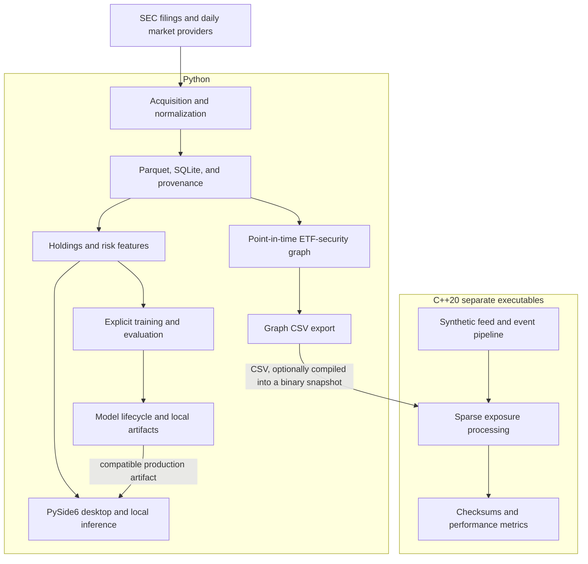
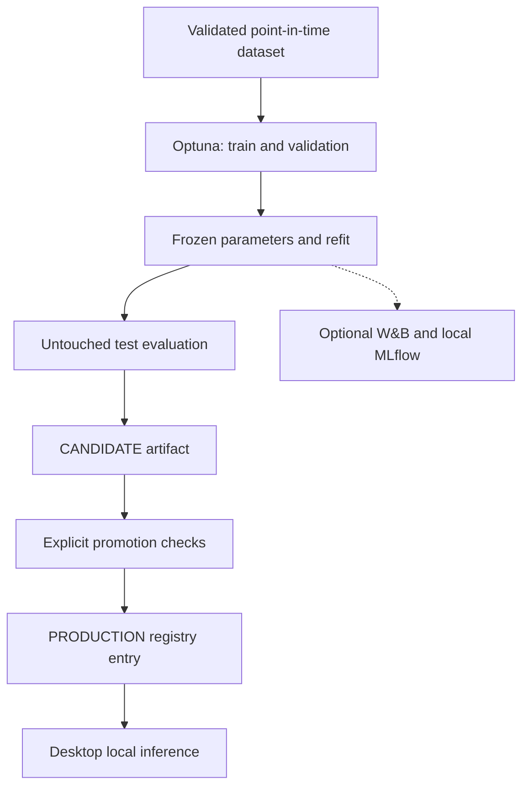

# System architecture

ETF Genome combines a Python data/research/application layer with a separate C++20 native systems layer. The shared domain is ETF holdings and their security exposures. Explicit files connect the layers; the desktop, research orchestration, and native feed have independent process lifecycles.

This document owns the system-wide design. [Project status](PROJECT_STATUS.md) records implemented capabilities, [validation](VALIDATION.md) records evidence, and the [roadmap](ROADMAP.md) owns future work.

## System overview

The native feed generates prices locally. It is not a connection to the Python market-data provider. The desktop reads Python-managed data and model artifacts; it does not consume the C++ TCP pipeline.

## Python module ownership

All package paths below are relative to `src/etf_genome/`.

| Module | Responsibility |
| --- | --- |
| `config` and `logging_config.py` | Environment/settings resolution, local directories, credential-aware logging |
| `domain` | Fund/security identities and typed analytical results |
| `data/sources` | SEC transport/discovery/XML parsing and daily market-provider adapters |
| `data/normalization` and `data/ingestion` | Canonical holdings, units, provider sync, retries, and provenance |
| `data/storage` | Parquet snapshots/bars, SQLite catalogs, response cache, DuckDB summaries with Polars fallback |
| `features`, `genome`, and `drift` | Concentration, exposures, drift, market features, and point-in-time risk datasets |
| `training` | Explicit tabular risk-baseline training and chronological evaluation |
| `experiments` | Optuna studies, optional tracking, frozen candidates, and file-based model registry |
| `graph` | Fund-universe resolution, publication-aware snapshots, overlap/crowding, direct shocks, and native export |
| `sync` and `services` | Refresh eligibility, application status, cached views, and local risk inference |
| `desktop` | PySide6 presentation and background-worker lifecycle |
| `orchestration` | Reusable data publication and training tasks called by orchestration definitions |

Feature calculations do not import PySide6 or perform provider requests. The desktop receives prepared views and delegates refresh decisions to `UpdateCoordinator`. Provider IO sits behind transport/provider interfaces, so tests can use synthetic payloads and fake transports.

The standalone graph representation scaffold is `research/graph/baseline.py`. `research/python`, `research/r`, and `scala` currently contain orientation notes rather than separate implemented engines. The `serving` and `monitoring` package directories are placeholders, not deployed services.

## Data and time contracts

The acquisition path is source response, normalization, canonical frame, Parquet plus SQLite metadata, then analytical reads. The synthetic demo also writes and reads its snapshots before reporting concentration and drift. It exercises the storage boundary without provider access.

Fund identity uses official CIK/series identifiers where available; a ticker is a label. Security identity prefers supplied CUSIP/ISIN, then ticker and a documented name fallback. Missing identifiers, classifications, weights, and prices remain explicit. Signed weights are preserved; percentages are converted using declared units, not guessed.

Portfolio report date, SEC publication date, and local retrieval time have different meanings. Graph snapshots and risk joins only use filings public at their decision date. A report dated earlier does not make its holdings available before publication. Chronological training and target-window checks protect the risk dataset from future information; temporal graph datasets are not implemented.

Market rows retain provider and adjustment mode. The current risk workflow uses the Twelve Data series consistently; comparison adapters do not silently overwrite or merge it. FRED/ALFRED ingestion is not implemented. See [data model](DATA_MODEL.md), [market data](MARKET_DATA.md), and [graph data model](GRAPH_DATA_MODEL.md) for exact schemas.

The graph edge-collapse path currently sums weights with Polars, which can turn an all-null group into `0.0`. Canonical holdings and native CSV support missing weights, but an already collapsed graph cannot recover that source distinction. Graph coverage and missing-weight counts must be interpreted with this limitation.

## Research, lifecycle, and inference

Optuna owns hyperparameter studies. W&B supplies optional research logs and can run offline; MLflow records local SQLite runs and artifacts. ETF Genome's own file-based registry owns lifecycle states and production selection. These are complementary services, not an external MLflow server dependency for the desktop.

The desktop selects a production model by fund, target, and feature family. If none is registered, the existing local risk-baseline artifact path is the fallback. It never chooses a model solely because it is the newest file. Missing or incompatible artifacts produce unavailable status.

Training, tuning, and promotion are explicit commands. Refreshing a market bar does not retrain or promote a model. See [experiment tracking](EXPERIMENT_TRACKING.md), [Optuna](OPTUNA.md), and [model lifecycle](MODEL_LIFECYCLE.md).

## Artifact and process boundaries

| Boundary | Artifact or interface | Owner and rule |
| --- | --- | --- |
| Ingestion to analytics | Canonical Parquet plus SQLite provenance | Python chooses availability dates and records source identity |
| Data publication to training | Validated dataset and fingerprint manifest | Research tasks verify input compatibility before training |
| Training to desktop | Model file, feature metadata, and production registry | Explicit promotion; inference needs no training scheduler |
| Python graph to C++ | `edges.csv` and optional `shocks.csv` | Python selects a valid as-of snapshot and preserves signed/missing weights |
| Native cold load to runtime | CSV or versioned binary graph snapshot | Native loader validates sizes, bounds, ids, weights, and checksum |
| Synthetic server to native client | EGMD binary frames over localhost TCP | Both sides must agree on graph instrument mapping and tick units |

The CSV exporter does not write the native binary format. `etf-genome-native snapshot-save` compiles an exported CSV into that format. Neither minimal graph format carries the full publication/provenance context; callers must retain the Python manifest alongside it.

C++ owns an immutable sparse graph, a bounded incremental decoder, a one-producer/one-consumer queue, and consumer-owned price exposure state. Portable components build on Linux and Windows; nonblocking sockets and epoll are Linux-only. Native executables have no Python/PySide6 dependency. See [native architecture](NATIVE_ARCHITECTURE.md) and [binary formats](BINARY_PROTOCOL.md) for memory ordering, failure handling, and shutdown.

## Desktop and offline behavior

`apps/desktop/main.py` launches the desktop runner. It builds a cached QQQ view and local risk status before the Qt window requests a background refresh. `UpdateCoordinator` gates SEC and market work using configuration, prior checks, cancellation, and backoff; the window owns thread/timer lifecycle.

`ETF_GENOME_OFFLINE_MODE=true` disables provider refresh. Missing credentials, stale data, unavailable models, and fetch failures remain visible; an error does not erase the previous cache. DuckDB is used when its native extension loads, otherwise holdings summaries use the explicit Polars fallback.

The Windows build runs locally without WSL2, PyTorch, CUDA, Airflow, Kubeflow, a C++ feed, or a database server. Model/data artifacts are local files. A source checkout uses its configured data directory; frozen builds default to `%LOCALAPPDATA%\ETFGenome`. Packaging remains a local recipe, with no signed release or installer included. See [background updates](BACKGROUND_UPDATES.md), [Windows packaging](WINDOWS_PACKAGING.md), and [DuckDB on Windows](DUCKDB_WINDOWS.md).

## Orchestration and dependency isolation

Airflow definitions under `orchestration/airflow/` coordinate research data tasks. Kubeflow definitions under `orchestration/kubeflow/` consume validated datasets and coordinate tuning, training, evaluation, and candidate registration. Neither performs automatic production promotion or replaces desktop refresh. Definition tests and compilation do not establish scheduler/container/cluster execution.

| Optional group | Purpose |
| --- | --- |
| Core and `data` | Local analytical storage, normalization, and provider interfaces |
| `desktop` | PySide6 presentation |
| `ml` | XGBoost and scikit-learn research dependencies; XGBoost local inference |
| `training` | Optuna studies |
| `research` | Optional W&B and MLflow, with a SQLAlchemy compatibility bound |
| `orchestration-airflow`, `orchestration-kubeflow` | Dedicated orchestration environments |
| `dev`, `packaging` | Quality checks and local Windows build tools |

The packaging specification excludes research/orchestration SDKs and PyTorch. Linux/WSL research environments exchange validated artifacts with the Windows application, not Python environments or shared process memory. Avoid simultaneous cross-environment writers to the same SQLite files. The holdings catalog, Optuna database, MLflow database, and Airflow metadata database have separate ownership.

See [orchestration architecture](ORCHESTRATION_ARCHITECTURE.md) for task/storage boundaries and [graph research environment](GRAPH_RESEARCH_ENVIRONMENT.md) for the observed Windows native-library constraint and isolated Linux setup.
