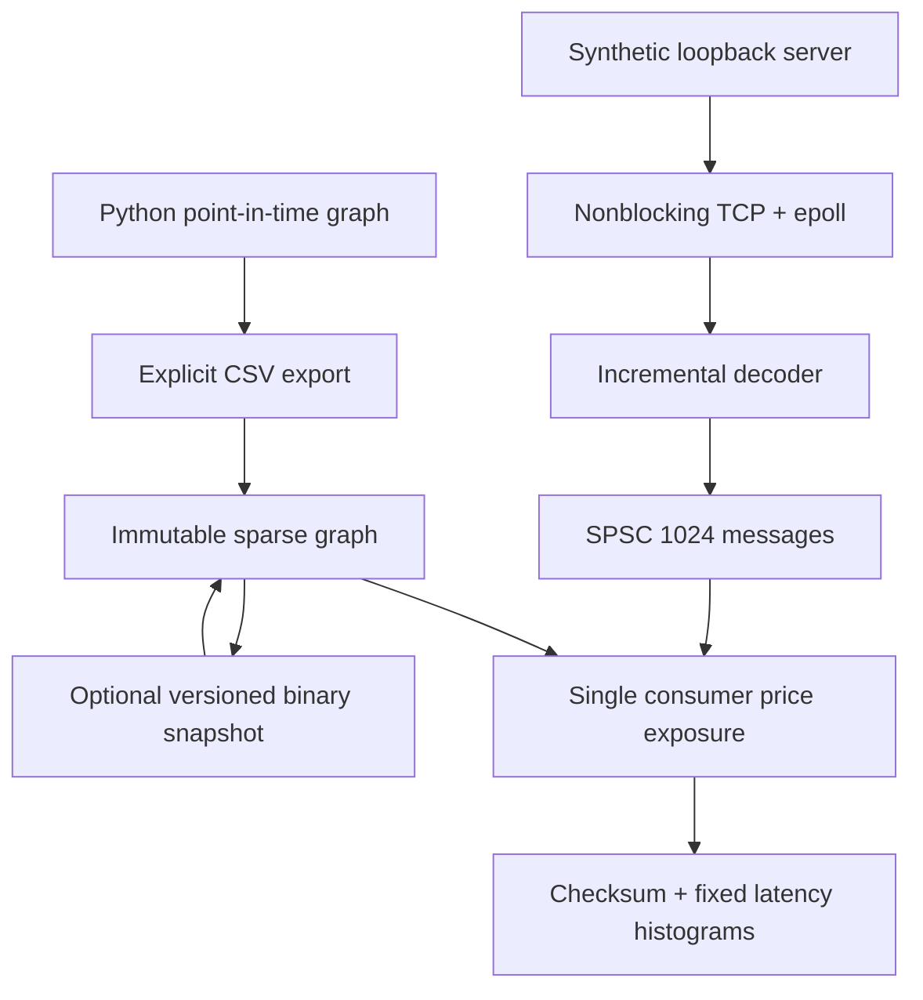

# Native market-data architecture

ETF Genome's C++20 systems layer combines a portable exposure core with a
synthetic Linux market-data pipeline. Python retains acquisition, SEC and
market-provider normalization, point-in-time storage, research, ML, graph export,
and the PySide6 desktop. C++
owns the separate synthetic runtime: framing, Linux networking, event transfer,
price state, sparse updates, measurement, and shutdown. The desktop does not
start this runtime. No exchange or order-routing adapter is implemented.

## Source and platform boundaries

| Source | Responsibility | Platform |
| --- | --- | --- |
| `exposure.hpp`, `exposure.cpp`, `csv.cpp` | Immutable reverse index, static scenario evaluation, CSV validation | Portable |
| `risk/price_exposure.hpp`, `price_exposure.cpp` | Persistent reference prices, returns, affected fund impacts | Portable |
| `risk/snapshot.hpp`, `snapshot.cpp` | Explicit versioned graph storage | Portable |
| `market/*`, `protocol.cpp`, `decoder.cpp` | Fixed runtime message, byte serialization, bounded incremental decoder | Portable |
| `spsc_queue.hpp`, `concurrency/cacheline.hpp` | One-producer/one-consumer ownership transfer | Portable lock-free size_t atomics required |
| `metrics/*`, `core/clock.hpp` | Sequence observation, histograms, monotonic time | Portable; Linux raw clock preferred |
| `network/*`, `socket.cpp`, `epoll.cpp`, `feed.cpp` | RAII descriptors, connect/accept, Linux loopback feed | Linux |
| `apps/benchmark.cpp`, `benchmarks/*` | Component measurements, allocation hook self-check | Portable; TCP mode Linux |
| `apps/feed_server.cpp`, `apps/feed_client.cpp` | Synthetic feed CLI and signal-driven lifecycle | Linux |

CMake selects C++20, disables compiler extensions, and supplies strong warnings.
Warnings-as-errors is optional locally and enabled in CI. Networking defaults
on for Linux, off elsewhere, and can be disabled for a portable-only build.
ASan/UBSan and TSan are separate configurations. No mandatory paid library,
subscription, or hosted infrastructure is introduced. Local verification and
toolchain results are recorded in [VALIDATION.md](VALIDATION.md). Local benchmark
methodology and results are recorded separately in
[NATIVE_PERFORMANCE.md](NATIVE_PERFORMANCE.md).

## Network lifecycle and failure behavior

The server binds only IPv4 `127.0.0.1`, accepts one connection, and closes after
its synthetic stream. Descriptors are move-only RAII objects. Socket creation
uses nonblocking and close-on-exec flags; connect completion is checked with
`SO_ERROR`. No user-supplied external host is accepted.

Epoll is explicitly level-triggered. Receive handlers attempt at most 32 reads
per readiness wake, each into a fixed 16 KiB buffer. Remaining data stays
readable for the next wake. `EAGAIN`/`EWOULDBLOCK` return to readiness waiting;
`EINTR` is retried. A read of zero invokes decoder EOF validation. A reset and
other socket errors carry an error category, errno, and operation.

The sender maintains a frame offset across partial writes. It waits for
EPOLLOUT when blocked, observes progress deadlines, and uses `MSG_NOSIGNAL`.
Small configurable send chunks permit fragmentation tests. Read/write and
accept waits check stop at bounded intervals (normally 50 ms). Notifications
and pacing can wake sooner. Scheduling and callback duration prevent a hard
shutdown-time guarantee.

The incremental decoder accepts fragmented headers/payloads and several frames
in one read. It buffers at most 64 wire bytes, validates a complete header before
accepting a payload, and exposes bytes consumed. A rejected sink retains the
completed message; the caller can retry it with empty input before supplying the
unconsumed tail. Protocol errors are sticky until reset. The feed enqueue sink
normally waits until accepted, so it does not discard a valid frame on full.

EOF with a partial/undelivered frame is an error. EOF at a frame boundary is
clean even if no SnapshotEnd was received: the runtime validates framing, not a
complete application-session state machine. Sequence anomalies are counted and
still delivered. There is no gap recovery, reconnect, deduplication history,
TLS, authentication, or exchange-specific semantics. The binary contract is
documented in [BINARY_PROTOCOL.md](BINARY_PROTOCOL.md).

## Ownership, ordering, and backpressure

The feed creates exactly one network producer and one processing consumer with
`std::jthread`. Only the producer calls `try_push`; only the consumer calls
`try_pop` and the exposure callback. The callback is a nonthrowing function
pointer with caller-owned context. The graph outlives the callback state.

The SPSC has 1024 usable messages and one extra sentinel slot. Payloads have
trivial, nonthrowing value semantics. The producer writes the complete payload
then publishes its index with release; the consumer observes it with acquire
before reading. The consumer releases its read index and the producer acquires
it before reusing a slot. Cached opposing indices reduce shared atomic reads.

Producer and consumer indices are separated by a stable 64-byte padding value.
This is a deliberate default, not a claim about every CPU cache line. An opt-in
compiler hardware-interference-size setting is ABI-sensitive and must match
across translation units. The existing arbitrary-capacity ring representation
is retained; it does not assume a power-of-two capacity.

Full/empty queue operations return immediately. The feed chooses lossless
backpressure: failed pushes increment `queue_full_events`, then sleep on a
notification with a 1 ms bounded wait before retrying. The same message can
produce several failed attempts; the counter is not a dropped-message count.
While waiting, reading stops and kernel TCP backpressure reaches the sender.
The isolated queue benchmark and scenario replay instead yield and retry.
Notifications use a mutex only for waiting; payload ownership remains SPSC.

SIGINT/SIGTERM handlers only set `sig_atomic_t`. Main requests a shared stop
source, wakes waiters, and joins workers before destroying sockets and queues.
Normal cancellation stops production and drains already queued events. Consumer
rejection/affinity failure stops processing and may leave queued messages.
Thread-startup allocation/system failures stop and join any started producer
before propagation. Optional Linux CPU affinity is disabled by default; invalid
or denied pinning is an explicit error.

## Memory and exposure representation

Graph loading is a cold path: CSV/binary parsing, canonical sorting, id/ticker
maps, and vector allocation happen before processing. The immutable numeric
reverse index is `offsets[S + 1]` and contiguous `ExposureLink[E]` entries,
grouped by security. Each entry contains fund index, signed weight, and weight
presence. String/alias maps are used for export and static scenario resolution,
not for ordinary indexed price events.

The price engine preallocates reference prices and returns for S securities,
and impacts for F funds. SnapshotStart validates S and resets arrays in
`O(S + F)`. First positive price establishes a security reference. Later updates
calculate the change in reference-relative return and traverse only that
security's offset span. Per-event work is `O(degree(security))`, including
duplicate links; it never scans every fund or holding to update one security.
An incremental checksum avoids a per-event full-fund sum.

Reported zero weights contribute zero; missing weights are skipped; signed
short weights remain negative. Trade/Heartbeat/SnapshotEnd do not alter the
price-only model. Invalid instrument, nonpositive price, snapshot mismatch, or
nonfinite result is fatal to that engine state. Overflow can leave partial
results, so callers discard the state. Double rounding can accumulate during
long streams; tests use numerical tolerances against scalar reference values.
Reference-relative exposure is not portfolio NAV, secondary propagation,
currency conversion, a forecast, or an execution model.

Messages use fixed value storage; frames, decoder buffer, queue, and histograms
are bounded. No per-message string formatting or console logging occurs in the
processing path. Thread construction, networking setup, loading, final report
formatting, and runtime/libc facilities may allocate. Allocation measurements
count replaceable C++ operator-new calls only in named post-warmup scopes;
TCP instrumentation covers the exposure callback. The performance document
does not infer process-wide allocation freedom from those counters.

## Python artifact boundary

`scripts/export_native_graph.py` exports an already selected point-in-time edge
snapshot and scenario. CSV preserves signed/missing weights and ids; the native
CLI optionally compiles that into a validated binary graph. Graph provenance,
publication date, FX assumptions, and ticker mapping remain the exporter's
responsibility; neither minimal format supplies all research metadata.

Static scenario parity is checked against the existing Python engine. Native
price-stream tests compare persistent state against a scalar mathematical
reference and check signed, missing, zero, duplicate, and invalid inputs. A
separate native process is the current boundary. Full pybind11 integration is
**not implemented**. The desktop retains its existing behavior and dependency
graph; its backend remains Python.

Future performance engineering, Python/C++ integration, runtime reliability,
and temporal graph research are maintained in the
[project roadmap](ROADMAP.md).
