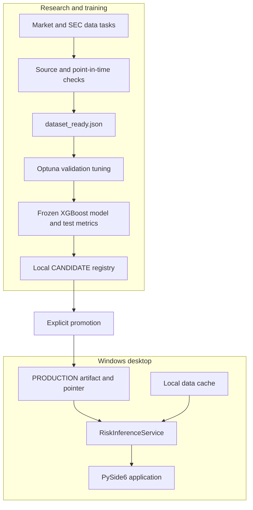

# Orchestration architecture

ETF Genome supplies research orchestration definitions and reusable local services. These are separate from the Windows desktop runtime. See [Architecture](ARCHITECTURE.md) for the full system and [Project Status](PROJECT_STATUS.md) for validation limits.

The diagram describes service responsibilities and the intended artifact handoff. Definitions, import checks, and pipeline compilation do not establish a running Airflow scheduler, completed container training, or a Kubernetes deployment.

## Responsibilities

The [Airflow DAGs](AIRFLOW.md) call existing source synchronization and dataset services. Market and SEC DAGs refresh their respective inputs; a separate dataset DAG validates publication-aware joins and publishes prepared dataset files plus `dataset_ready.json`. Its schedule is unset, so new data does not trigger training automatically.

The [Kubeflow pipeline definition](KUBEFLOW.md) consumes that manifest and the expected fingerprint. The real training service tunes on validation, freezes the best trial, scores the untouched test split, and registers a `CANDIDATE`. Later components enforce ordering and state boundaries. They do not implement independent distributed evaluation or automatic promotion.

[Optuna](OPTUNA.md), [experiment tracking](EXPERIMENT_TRACKING.md), and the [local model registry](MODEL_LIFECYCLE.md) have distinct ownership. MLflow records optional run provenance; `ModelRegistryService` owns the artifact and production pointer. `scripts/promote_model.py` is the explicit local promotion command.

`ETFGenome.exe` does not import Airflow, Kubeflow, Kubernetes, or Docker. Its `UpdateCoordinator` refreshes the local cache while the application is open and then scores saved models; see [Background Updates](BACKGROUND_UPDATES.md).

## Environments and execution boundaries

Airflow targets a dedicated Linux/WSL environment, separate from the Windows desktop virtual environment. KFP SDK subprocess execution also requires a suitable Unix-style `python3` command and component dependencies. Windows can compile the definition in the separate `.venv-kfp` environment; compilation does not execute the pipeline.

`containers/training/Dockerfile` supplies a Linux research image definition. Current KFP component decorators use `python:3.12-slim`, so using the supplied training image requires explicit image/dependency configuration. Container execution also needs accessible dataset and artifact storage; cluster execution needs a configured backend. These deployment workstreams are tracked in the [Roadmap](ROADMAP.md#orchestration-deployment).

Do not embed host-specific paths in DAG or component source. Pass data and project roots through `ETF_GENOME_DATA_DIR`, `AIRFLOW_HOME`, and pipeline arguments, and resolve them at runtime.

## SQLite ownership

These files have separate purposes:

| Database | Owner | Avoid concurrent writers from |
| --- | --- | --- |
| `data/catalog.sqlite` | Desktop and research data tasks | Windows app and a WSL DAG sharing the same catalog |
| `data/optuna/optuna.db` | Optuna studies | Separate Windows and WSL training processes |
| `data/mlflow/mlflow.db` | MLflow tracking | Local training and container tasks sharing the same file |
| `$AIRFLOW_HOME/airflow.db` | Airflow metadata | ETF Genome catalog services |

Use one active workflow writer per local database. Airflow's metadata configuration must not point at `catalog.sqlite`.

## Failure behavior

Point-in-time validation runs before staged dataset files replace the live files. A validation failure preserves the previous dataset. File replacement is performed per artifact; this is not a transaction over all files.

A training or tracking failure may leave a saved experiment without candidate registration. It does not promote a model or replace a production registry record. A newer candidate is not selected by the desktop until explicit promotion.

## Secrets

SEC contact details and provider API keys come from environment variables. They do not belong in DAGs, components, dataset manifests, model metadata, or public logs. Orchestration does not change provider provenance or rate-limit requirements; see [Market Data](MARKET_DATA.md).
